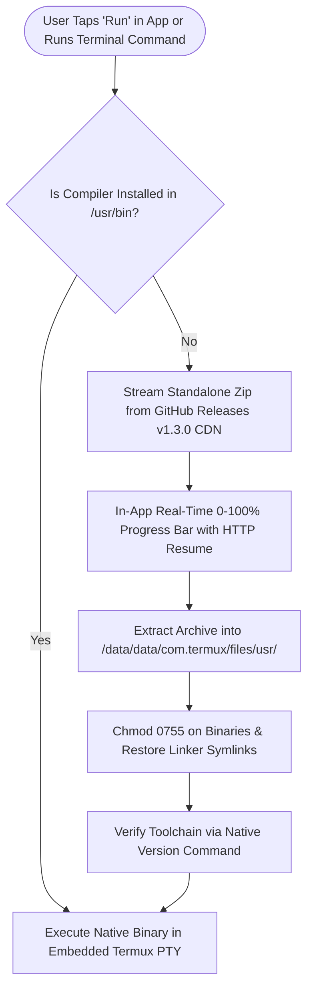

# TermCode IDE - Multi-Language Compiler & Runtime Library 🚀
### *Official Standalone Toolchain & Runtime Distribution Platform for CodeEditor IDE on Android (`aarch64` / ARM64)*

[](https://github.com/raj40870-pixel/library/releases/tag/v1.3.0)
[](https://github.com/raj40870-pixel/code-eidter-app)
[](https://code-eidter-apk-website.vercel.app/)
[](https://github.com/raj40870-pixel/library)
[](licenses/Apache-2.0.txt)

---

## 🌐 Ecosystem Quick Links

- 📱 **Official Android App Repository**: [raj40870-pixel/code-eidter-app](https://github.com/raj40870-pixel/code-eidter-app)
- 🌐 **Official Web Portal & APK Download**: [https://code-eidter-apk-website.vercel.app/](https://code-eidter-apk-website.vercel.app/)
- 📦 **Latest Toolchain Release (v1.3.0)**: [GitHub Releases v1.3.0](https://github.com/raj40870-pixel/library/releases/tag/v1.3.0)
- 🛡️ **Full Audit & Verification Report**: [LIBRARY_AUDIT.md](LIBRARY_AUDIT.md)

---

## 🌟 Overview

This repository hosts the official pre-built, optimized compiler toolchains and runtime environments for **CodeEditor IDE (TermCode)** on Android (`aarch64`).

Instead of relying on slow remote cloud servers or cumbersome manual installations, CodeEditor IDE delivers **direct native on-device compilation and execution**. Toolchains are distributed as high-speed standalone packages via GitHub Releases CDN (**v1.3.0**), pre-configured for instant extraction into the Termux sandboxed Linux userland (`/data/data/com.termux/files/usr/`).

---

## 🏛️ System Architecture & Delivery Flow



---

## 🚀 Supported Programming Languages & CDN Downloads (v1.3.0)

All packages below are compiled for **Android `aarch64` (ARM64)** and hosted globally on GitHub Releases CDN under tag **[`v1.3.0`](https://github.com/raj40870-pixel/library/releases/tag/v1.3.0)**:

| Language / Target | Included Tools & Runtimes | Version | Package (.zip) | Direct CDN Download (v1.3.0) | Download Size | Extracted Size | Verification Command |
| :--- | :--- | :---: | :---: | :---: | :---: | :---: | :--- |
| **Python 3** | Python 3, Pip, SQLite, OpenSSL | `3.14.6-1` | `python.zip` | [Download](https://github.com/raj40870-pixel/library/releases/download/v1.3.0/python.zip) | 22.0 MB | 57.8 MB | `python3 --version` |
| **C & C++** | Clang 21, Clang++, GCC, G++, Make, STL | `21.1.8-3` | `c_cpp.zip` | [Download](https://github.com/raj40870-pixel/library/releases/download/v1.3.0/c_cpp.zip) | 207.0 MB | 526.9 MB | `clang --version && clang++ --version` |
| **Java** | OpenJDK 21 HotSpot JVM, javac, java, jar | `21.0.12` | `java.zip` | [Download](https://github.com/raj40870-pixel/library/releases/download/v1.3.0/java.zip) | 143.2 MB | 192.0 MB | `javac -version && java -version` |
| **Node.js & TS** | Node.js V8 Runtime, NPM, TypeScript (`ts-node`) | `26.4.0-1` | `nodejs.zip` | [Download](https://github.com/raj40870-pixel/library/releases/download/v1.3.0/nodejs.zip) | 73.1 MB | 197.8 MB | `node -v && npm -v` |
| **Go (Golang)** | Go Compiler, Toolchain & Full Standard Library | `3:1.27.1` | `go.zip` | [Download](https://github.com/raj40870-pixel/library/releases/download/v1.3.0/go.zip) | 269.7 MB | 741.1 MB | `go version` |
| **Rust** | Rustc Compiler (LLVM backend), Cargo | `1.98.1-1` | `rust.zip` | [Download](https://github.com/raj40870-pixel/library/releases/download/v1.3.0/rust.zip) | 283.0 MB | 1,226.1 MB | `rustc --version && cargo --version` |
| **Kotlin** | Kotlinc JVM Compiler & Kotlin Runtime | `2.4.20` | `kotlin.zip` | [Download](https://github.com/raj40870-pixel/library/releases/download/v1.3.0/kotlin.zip) | 228.1 MB | 283.2 MB | `kotlinc -version` |
| **C# (.NET)** | Mono 6.14 Runtime, MCS C# Compiler | `6.14.1-2` | `csharp.zip` | [Download](https://github.com/raj40870-pixel/library/releases/download/v1.3.0/csharp.zip) | 109.8 MB | 294.5 MB | `mcs --version && mono --version` |
| **PHP** | PHP 8.5 CLI Interpreter & Modules | `8.5.1` | `php.zip` | [Download](https://github.com/raj40870-pixel/library/releases/download/v1.3.0/php.zip) | 82.6 MB | 254.7 MB | `php -v` |
| **Ruby** | Ruby 4.0 Interpreter, RubyGems, Bundler | `4.0.7` | `ruby.zip` | [Download](https://github.com/raj40870-pixel/library/releases/download/v1.3.0/ruby.zip) | 28.0 MB | 71.1 MB | `ruby -v` |
| **Lua** | Lua 5.4 Standalone Interpreter | `5.4.8-10` | `lua.zip` | [Download](https://github.com/raj40870-pixel/library/releases/download/v1.3.0/lua.zip) | 1.0 MB | 2.2 MB | `lua -v` |

---

## ⚡ Installation Methods

### Method 1: Automatic Zero-Config In-App Installation (Recommended)
You do not need to install anything manually!
1. Open any file (e.g. `main.py`, `main.cpp`, `Main.java`) in **CodeEditor IDE**.
2. Tap the **RUN (▶️)** button.
3. The IDE automatically detects if the required compiler is missing, opens a **0%–100% download progress dialog**, downloads the verified package directly from GitHub Releases CDN (`v1.3.0`), extracts it, and executes your code immediately.

---

### Method 2: Terminal Package Manager (`pkg install`)
Inside the integrated CodeEditor / Termux terminal:

```bash
# Install all 11 toolchains at once:
pkg install all

# Or install individual toolchains:
pkg install python     # Python 3.14 + Pip + SQLite
pkg install clang      # C & C++ Clang 21, GCC, G++, Make
pkg install java       # OpenJDK 21, javac, java, jar
pkg install nodejs     # Node.js 26, NPM, TypeScript
pkg install go         # Golang 1.27 compiler & stdlib
pkg install rust       # Rustc 1.98 compiler, Cargo
pkg install kotlin     # Kotlin 2.4 JVM compiler & kotlinc
pkg install csharp     # Mono 6.14 C# runtime & MCS compiler
pkg install php        # PHP 8.5 CLI interpreter
pkg install ruby       # Ruby 4.0 interpreter & RubyGems
pkg install lua        # Lua 5.4 standalone interpreter
```

---

### Method 3: 1-Line Universal Curl Installer
Run any command below in the terminal:

```bash
# Master Installer (All 11 Languages)
curl -sL https://raw.githubusercontent.com/raj40870-pixel/library/main/install.sh | sh -s all

# Python 3
curl -sL https://raw.githubusercontent.com/raj40870-pixel/library/main/install.sh | sh -s python

# C & C++ (Clang / LLVM)
curl -sL https://raw.githubusercontent.com/raj40870-pixel/library/main/install.sh | sh -s c_cpp

# Java (OpenJDK 21)
curl -sL https://raw.githubusercontent.com/raj40870-pixel/library/main/install.sh | sh -s java

# Node.js & TypeScript
curl -sL https://raw.githubusercontent.com/raj40870-pixel/library/main/install.sh | sh -s nodejs

# Go
curl -sL https://raw.githubusercontent.com/raj40870-pixel/library/main/install.sh | sh -s go

# Rust
curl -sL https://raw.githubusercontent.com/raj40870-pixel/library/main/install.sh | sh -s rust

# Kotlin
curl -sL https://raw.githubusercontent.com/raj40870-pixel/library/main/install.sh | sh -s kotlin

# C# (.NET / Mono)
curl -sL https://raw.githubusercontent.com/raj40870-pixel/library/main/install.sh | sh -s csharp

# PHP
curl -sL https://raw.githubusercontent.com/raj40870-pixel/library/main/install.sh | sh -s php

# Ruby
curl -sL https://raw.githubusercontent.com/raj40870-pixel/library/main/install.sh | sh -s ruby

# Lua
curl -sL https://raw.githubusercontent.com/raj40870-pixel/library/main/install.sh | sh -s lua
```

---

## 🏃 Code Execution Quick Reference

Once a compiler or runtime is installed, you can execute code either by tapping **RUN (▶️)** or directly in the terminal:

| Language | Starter File | Compile Command | Run Command |
| :--- | :--- | :--- | :--- |
| **Python** | `main.py` | *(Interpreted)* | `python3 -u main.py` |
| **C** | `main.c` | `clang -Wall -O2 main.c -o main` | `./main` |
| **C++** | `main.cpp` | `clang++ -std=c++17 -Wall -O2 main.cpp -o main` | `./main` |
| **Java** | `Main.java` | `javac Main.java` | `java Main` |
| **JavaScript** | `main.js` | *(Interpreted)* | `node main.js` |
| **TypeScript** | `main.ts` | `npx tsc main.ts` | `npx ts-node main.ts` |
| **Go** | `main.go` | `go build -o app main.go` | `go run main.go` |
| **Rust** | `main.rs` | `rustc main.rs -o main` | `./main` |
| **Kotlin** | `Main.kt` | `kotlinc Main.kt -include-runtime -d Main.jar` | `java -jar Main.jar` |
| **C#** | `Program.cs` | `mcs Program.cs -out:Program.exe` | `mono Program.exe` |
| **PHP** | `index.php` | *(Interpreted)* | `php index.php` |
| **Ruby** | `main.rb` | *(Interpreted)* | `ruby main.rb` |
| **Lua** | `main.lua` | *(Interpreted)* | `lua main.lua` |
| **HTML / Web**| `index.html`| *(Background HTTP Server)* | `python3 -m http.server 8080` *(In-App Web Preview)* |

---

## 📂 Repository Layout

```text
library/
├── .github/workflows/
│   └── ci.yml                 # Automated validation workflow
├── manifests/                 # JSON runtime metadata schemas
│   ├── index.json             # Master language catalog
│   ├── c.json                 # C Clang manifest
│   ├── cpp.json               # C++ Clang++ manifest
│   ├── java.json              # OpenJDK 21 manifest
│   ├── python.json            # Python 3 manifest
│   ├── nodejs.json            # Node.js manifest
│   ├── typescript.json        # TypeScript manifest
│   ├── go.json                # Golang manifest
│   ├── rust.json              # Rustc & Cargo manifest
│   ├── kotlin.json            # Kotlin manifest
│   ├── csharp.json            # Mono C# manifest
│   ├── php.json               # PHP CLI manifest
│   ├── ruby.json              # Ruby manifest
│   ├── lua.json               # Lua manifest
│   └── web.json               # Web static server manifest
├── licenses/
│   ├── THIRD-PARTY-NOTICES.md # Open source third-party notices
│   ├── Apache-2.0.txt         # Apache 2.0 License
│   └── MIT.txt                # MIT License
├── scripts/
│   ├── audit-library.js       # Directory inventory and audit script
│   ├── build-manifests.js     # Generates manifest JSON schemas
│   ├── package-runtimes.js    # Packages runtimes into archives
│   ├── validate-library.js    # Validates schemas and binary integrity
│   └── test-server.js         # HTTP test suite
├── c_cpp/                     # Extracted Clang/LLVM toolchain rootfs
├── java/                      # Extracted OpenJDK 21 rootfs
├── python/                    # Extracted Python 3.14 rootfs
├── nodejs/                    # Extracted Node.js 26 rootfs
├── go/                        # Extracted Go 1.27 rootfs
├── rust/                      # Extracted Rust 1.98 rootfs
├── kotlin/                    # Extracted Kotlin 2.4 rootfs
├── csharp/                    # Extracted Mono 6.14 rootfs
├── php/                       # Extracted PHP 8.5 rootfs
├── ruby/                      # Extracted Ruby 4.0 rootfs
├── lua/                       # Extracted Lua 5.4 rootfs
├── install.sh                 # Universal client installation script
├── LIBRARY_AUDIT.md           # Comprehensive inventory and verification audit
└── README.md                  # Main documentation
```

---

## ⚖️ License & Attribution

- Distribution scripts and manifest metadata are licensed under the [Apache-2.0 License](licenses/Apache-2.0.txt).
- All distributed binaries and toolchains are copyright of their respective upstream authors (LLVM, GNU, OpenJDK, Python Software Foundation, OpenJS, Google, Rust Project, JetBrains, Mono Project, PHP Group, Lua.org, Termux). See [licenses/THIRD-PARTY-NOTICES.md](licenses/THIRD-PARTY-NOTICES.md) for full notices.
